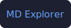

# サンプル Vault

これは **Markdown Explorer** の動作確認用フォルダ。フォルダ選択でここを選ぶ、と。



## GFM の確認

| 機能           | 対応 |
| -------------- | :--: |
| 表             |  ✅  |
| タスクリスト   |  ✅  |
| コードハイライト |  ✅  |

### タスクリスト

- [x] フォルダ走査
- [x] 三分割UI
- [ ] 本文の全文検索（あとで）

### コード

```ts
function greet(name: string): string {
  return `こんにちは、${name}`
}
```

> 引用も、こんなふうに出る。

## リンク

- [ガイドへ](./docs/guide.md) ← クリックでビューア内遷移
- [外部リンク](https://vite.dev/) ← 新規タブ
